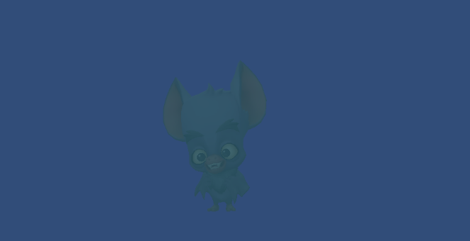
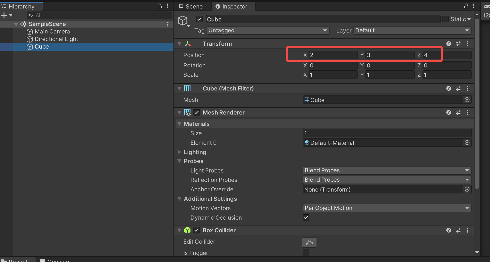
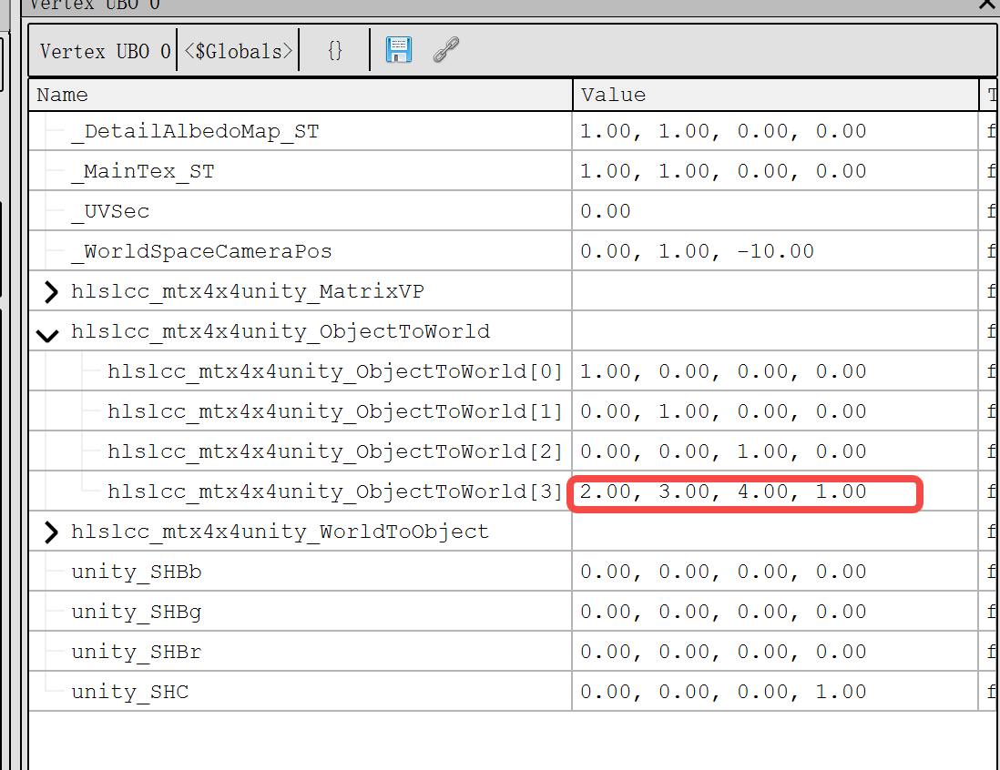

# unity_shader_selchargray
unlocked char gray effect analysis

## ref effect

## vs
uniform vec4 \_ProjectionParams;

uniform vec4 hlslcc\_mtx4x4unity\_ObjectToWorld[4];

uniform vec4 hlslcc\_mtx4x4unity\_MatrixVP[4];

uniform mediump vec4 \_MainTex\_ST;

in highp vec4 in\_POSITION0;

in highp vec4 in\_TEXCOORD0;

out highp vec4 vs\_TEXCOORD0;

out highp vec4 vs\_TEXCOORD1;

out highp vec4 vs\_TEXCOORD4;

vec4 u\_xlat0;

vec4 u\_xlat1;

void main()

{

` `u\_xlat0 = in\_POSITION0.yyyy \* hlslcc\_mtx4x4unity\_ObjectToWorld[1];

` `u\_xlat0 = hlslcc\_mtx4x4unity\_ObjectToWorld[0] \* in\_POSITION0.xxxx + u\_xlat0;

` `u\_xlat0 = hlslcc\_mtx4x4unity\_ObjectToWorld[2] \* in\_POSITION0.zzzz + u\_xlat0;

` `u\_xlat1 = u\_xlat0 + hlslcc\_mtx4x4unity\_ObjectToWorld[3];

|
// 世界空间坐标

vs\_TEXCOORD0 = hlslcc\_mtx4x4unity\_ObjectToWorld[3] \* in\_POSITION0.wwww + u\_xlat0;

u\_xlat0 = u\_xlat1.yyyy \* hlslcc\_mtx4x4unity\_MatrixVP[1];

u\_xlat0 = hlslcc\_mtx4x4unity\_MatrixVP[0] \* u\_xlat1.xxxx + u\_xlat0;

u\_xlat0 = hlslcc\_mtx4x4unity\_MatrixVP[2] \* u\_xlat1.zzzz + u\_xlat0;

u\_xlat0 = hlslcc\_mtx4x4unity\_MatrixVP[3] \* u\_xlat1.wwww + u\_xlat0;

gl\_Position = u\_xlat0;

// 裁切空间坐标

u\_xlat0.y = u\_xlat0.y \* \_ProjectionParams.x;

u\_xlat1.xzw = u\_xlat0.xwy \* vec3(0.5, 0.5, 0.5);

vs\_TEXCOORD1.zw = u\_xlat0.zw;

vs\_TEXCOORD1.xy = u\_xlat1.zz + u\_xlat1.xw;

// uv

vs\_TEXCOORD4.xy = in\_TEXCOORD0.xy \* \_MainTex\_ST.xy + \_MainTex\_ST.zw;

vs\_TEXCOORD4.zw = in\_TEXCOORD0.zw;

return;
|
| :- |
}

## ps

precision highp float;

precision highp int;

uniform         mediump vec4 \_MixColor;

uniform         mediump vec4 \_ConcealmentColor;

uniform         mediump float \_Concealment;

uniform         mediump float \_FadeGameplayEffects;

uniform         mediump vec4 \_SSGradientColor0;

uniform         mediump vec4 \_SSGradientColor1;

uniform         mediump vec2 \_SSGradientDirection;

uniform mediump sampler2D \_MainTex;

in highp vec4 vs\_TEXCOORD1;

in highp vec4 vs\_TEXCOORD4;

layout(location = 0) out mediump vec4 SV\_Target0;

vec2 u\_xlat0;

mediump vec4 u\_xlat16\_0;

mediump vec4 u\_xlat16\_1;

mediump vec3 u\_xlat16\_2;

mediump vec3 u\_xlat16\_3;

void main()

{

`   `// 按照一个可配置的灰度方向，和裁剪空间内顶点位置计算权重得到 u\_xlat0.x

`    `u\_xlat0.xy = vs\_TEXCOORD1.xy / vs\_TEXCOORD1.ww;

`    `u\_xlat0.xy = u\_xlat0.xy + vec2(-0.5, -0.5);

`    `u\_xlat0.x = dot(\_SSGradientDirection.xy, u\_xlat0.xy);

`    `u\_xlat0.x = u\_xlat0.x + 0.5;

#ifdef UNITY\_ADRENO\_ES3

`    `u\_xlat0.x = min(max(u\_xlat0.x, 0.0), 1.0);

#else

`    `u\_xlat0.x = clamp(u\_xlat0.x, 0.0, 1.0);

#endif

// 使用上一部权重和2个颜色计算合并色得 u\_xlat16\_0

`    `u\_xlat16\_1 = (-\_SSGradientColor0) + \_SSGradientColor1;

`    `u\_xlat16\_0 = u\_xlat0.xxxx \* u\_xlat16\_1 + \_SSGradientColor0;

// mixColor w作为权重，混合mixcolor和贴图色

`    `u\_xlat16\_2.xyz = texture(\_MainTex, vs\_TEXCOORD4.xy).xyz;

`    `u\_xlat16\_1.xyz = (-u\_xlat16\_2.xyz) + \_MixColor.xyz;

`    `u\_xlat16\_1.xyz = \_MixColor.www \* u\_xlat16\_1.xyz + u\_xlat16\_2.xyz;

`       `// concealment为0：完全使用隐藏色，为1：完全不使用隐藏色

`    `u\_xlat16\_1.xyz = u\_xlat16\_1.xyz + (-\_ConcealmentColor.xyz);

`    `u\_xlat16\_1.xyz = vec3(\_Concealment) \* u\_xlat16\_1.xyz + \_ConcealmentColor.xyz;

`    `u\_xlat16\_3.xyz = u\_xlat16\_1.xyz \* u\_xlat16\_0.xyz + (-u\_xlat16\_1.xyz);

`    `u\_xlat16\_0.xyz = u\_xlat16\_0.www \* u\_xlat16\_3.xyz + u\_xlat16\_1.xyz;

`    `u\_xlat16\_1.xyz = (-u\_xlat16\_0.xyz) + u\_xlat16\_2.xyz;

`    `u\_xlat16\_0.w = 1.0;

`    `u\_xlat16\_1.w = 0.0;

`    `SV\_Target0 = vec4(vec4(\_FadeGameplayEffects, \_FadeGameplayEffects, \_FadeGameplayEffects, \_FadeGameplayEffects)) \* u\_xlat16\_1 + u\_xlat16\_0;

`    `return;

}

## analysis

### properties:
\_SSGradientDirection.xy，灰度方向

\_SSGradientColor0: 灰度色1

\_SSGradientColor1：灰度色2

\_MixColor： 混合色，其中w为权重

\_ConcealmentColor:隐藏色

\_Concealment：隐藏色权重

\_FadeGameplayEffects: 最终混合权重

### calculate:
gdxy= 裁剪空间内在梯度方向投影

x2= 贴图色

x0= gdxy\*（\_SSGradientColor1-\_SSGradientColor0）+ \_SSGradientColor0

x1= \_ConcealmentColor \* （（\_MixColor.w \*(\_MixColor - x2) + x2）- \_ConcealmentColor +\_ConcealmentColor

x3 = x1 \* x0 - x1

t0=x0.w \* (x1\*x0-x1) + x1
finalColor = \_FadeGameplayEffects\*(x2 - t0) + t0

## note
Matrices in Unity are column major, but matrix:tostring function output by col.

matrix below:

captured by render doc:

